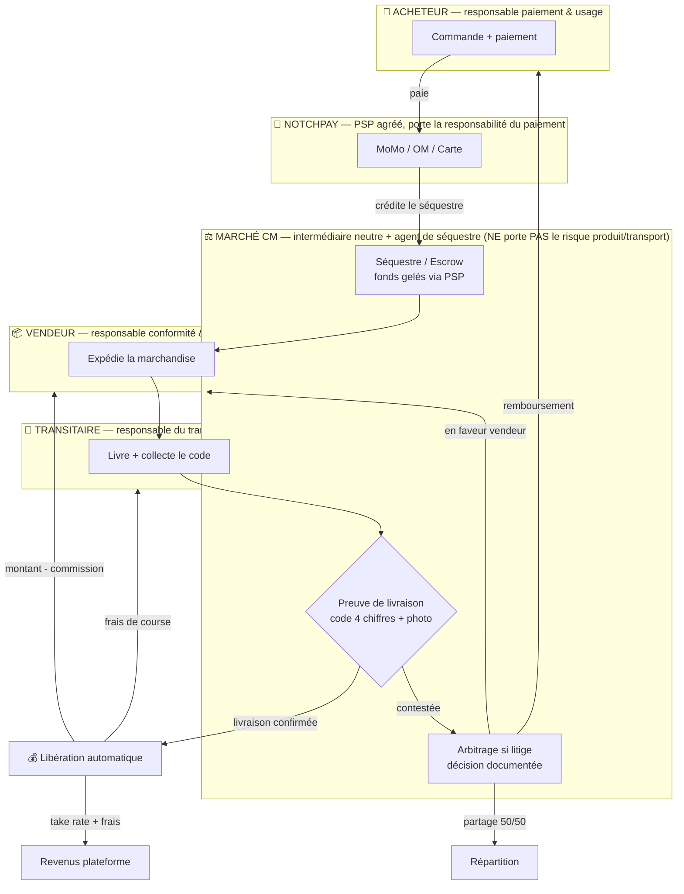
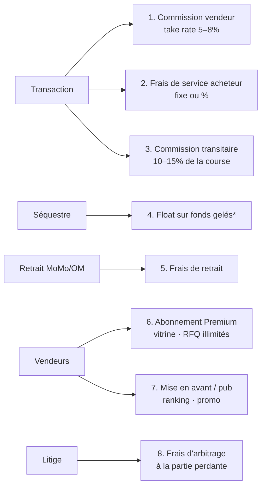

# Marché CM — Modèle économique & bouclier de responsabilité

> Objectif : permettre à la plateforme de **gagner de l'argent sur chaque transaction**
> tout en **ne portant ni le risque produit, ni le risque transport, ni le risque de
> paiement**. Modèle retenu : **place de marché intermédiaire à séquestre (escrow)**.

⚠️ **Avertissement** : ce document conçoit le modèle commercial et technique. Sa **validité
juridique au Cameroun (OHADA, CEMAC/COBAC, loi e-commerce, GIMAC/BEAC)** doit être
confirmée par un avocat local avant exploitation. Les écrans de consentement décrits ici
sont la condition *technique* du bouclier, pas une garantie *légale*.

---

## 1. Principe fondateur

**Marché CM n'est jamais ni vendeur, ni acheteur, ni transporteur, ni propriétaire de la
marchandise, ni établissement de paiement.**

C'est un **intermédiaire technique de mise en relation** + un **agent de séquestre**.

- Le **contrat de vente** se forme directement entre l'**acheteur** et le **vendeur**.
- Le **contrat de transport** se forme directement entre le **client** et le **transitaire**.
- Tout l'argent transite par un **PSP agréé tiers (NotchPay)** — la plateforme n'encaisse
  jamais en nom propre ; elle **instruit** la libération du séquestre selon des règles
  automatiques (preuve de livraison), jamais de façon discrétionnaire.

C'est cette neutralité, matérialisée par le consentement dans l'app, qui sépare
juridiquement la plateforme du risque.

---

## 2. Schéma — Flux d'argent (escrow) + zones de responsabilité

---

## 3. Matrice de transfert de responsabilité

| Risque / Obligation | Porté par | Mécanisme qui décharge la plateforme |
|---|---|---|
| Qualité / conformité du **produit** | **Vendeur** | KYB (RCCM), CGU vendeur, séquestre conditionné à la livraison |
| Intégrité pendant le **transport** | **Transitaire** | KYC transitaire, preuve d'enlèvement, code de livraison |
| Légalité de **l'usage** du produit | **Acheteur** | Acceptation CGU + KYC acheteur |
| **Traitement du paiement** (fraude, AML) | **PSP NotchPay** (agréé) | La plateforme n'encaisse pas en nom propre |
| **Détention des fonds** | Séquestre automatisé | Mandat de séquestre signé, libération par règle |
| **Litige** | Parties au contrat | Arbitrage tripartite **documenté** (preuves), décision opposable |
| **Données / KYC** | Plateforme (conformité LCB-FT) | Consentement horodaté + signature électronique |

---

## 4. Schéma — Points de capture de revenus (8 sources, sans porter le risque)

\* Le float sur fonds séquestrés est soumis à la réglementation CEMAC/COBAC — à valider
avec le PSP, sinon le retirer du modèle.

---

## 5. Conditions à matérialiser dans l'app (lien modèle ↔ code)

Le bouclier ne tient que si l'app **capture le consentement** de façon traçable :

1. **CGU + statut d'intermédiaire** affichés et **acceptés** (case + horodatage) à l'inscription.
2. **KYC/KYB avec signature électronique** (wizard 6 écrans — `screens-kyc.jsx`).
   Backend : `POST /api/auth/kyc/submit/` (`doc_type`, `file`, `signature`, `consent_accepted`
   → `consent_accepted_at` horodaté serveur).
3. **Mandat de séquestre** accepté au **premier paiement**.
4. **Preuve de livraison** (code 4 chiffres — déjà présent côté livreur).
5. **Traçabilité d'arbitrage** (preuves horodatées — hub de litige multi-vue).
6. **Mentions de déni de responsabilité** sur les écrans produit / panier / litige.

---

## 6. Statut d'implémentation

| Condition | État |
|---|---|
| KYC + signature + `consent_accepted_at` | ✅ backend ; ⚠️ front : flux `app` à re-skiner, `Clients` à créer |
| CGU/statut intermédiaire à l'inscription | ❌ à ajouter |
| Mandat de séquestre au 1er paiement | ❌ à ajouter |
| Code de livraison 4 chiffres | ✅ Driver |
| Arbitrage documenté | 🟠 partiel (hub multi-vue à unifier) |
| Mentions déni de responsabilité | ❌ à ajouter |
