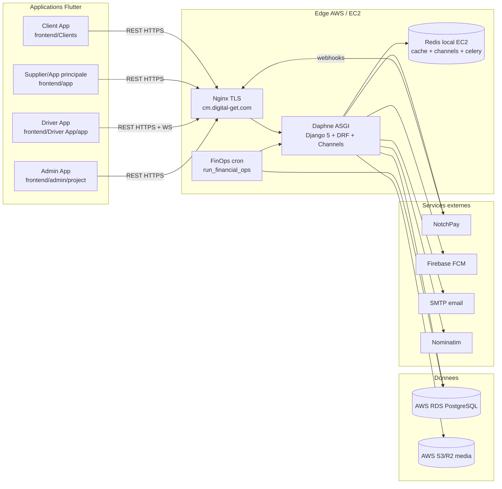
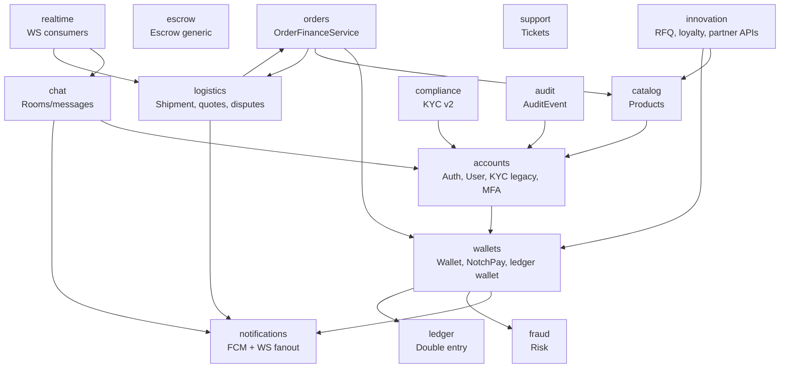
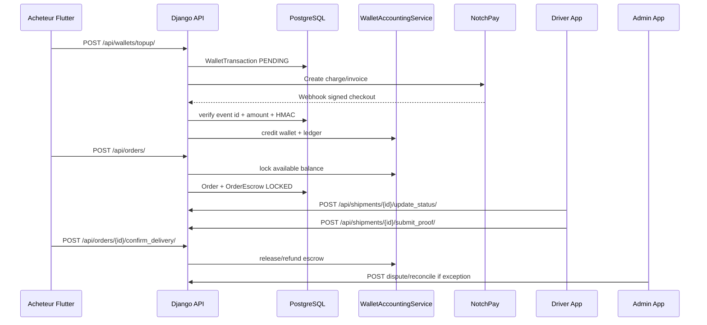
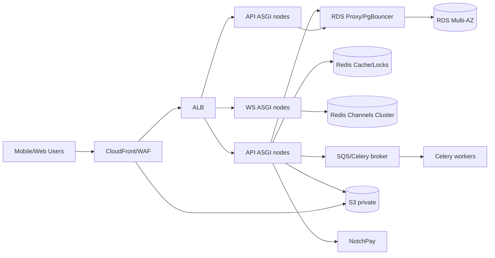

# AUDIT ARCHITECTURAL GLOBAL - ECOSYSTEME MARCHE CM

Date : 2026-06-05  
Portee : Django 5 / DRF / Channels / Celery / Redis / PostgreSQL / S3-R2 / Firebase / NotchPay / Flutter Client-Supplier-Driver-Admin / AWS EC2-RDS-S3 / Nginx / Daphne / Docker / CI-CD.  
Objectif : determiner les ecarts architecturaux, fonctionnels, techniques, securitaires, operationnels et financiers qui bloquent ou fragilisent une mise en production a grande echelle.

Sources utilisees :

- scan statique du depot (`rg`, lecture code backend/frontend/infra);
- comparaison API `python compare.py`;
- rapports existants : `RAPPORT_QA_E2E.md`, `resultats/QA_E2E_V2_REPORT.md`, `resultats/LOAD_TEST_REPORT.md`, `qa_e2e/SCREEN_BACKEND_ALIGNMENT.md`;
- audit infra : `infra/terraform/INVENTORY.md`, `infra/terraform/generated.tf`, `infra/terraform/observability.tf`;
- verification Django : `python manage.py check` -> OK.

Limites :

- l'audit AWS live n'a pas ete relance directement; l'analyse AWS repose sur l'inventaire Terraform du 2026-06-04;
- le script `qa_e2e/check_screen_backend_alignment.py` echoue localement si l'environnement charge `JWT_ALGORITHM=RS256` sans paire de cles valide;
- les simulations 10k/50k/100k sont une evaluation architecturale fondee sur le load test existant, pas un test distribue reel jusqu'a 100k.

---

## PHASE 1 - CARTOGRAPHIE DU SYSTEME

### Diagramme logique



### Diagramme des dependances backend



### Diagramme des flux de donnees critiques



### Cartographie des flux frontend

| App | Flux principaux | Dependances |
|---|---|---|
| Client App | auth, catalogue, panier, commandes, wallet, KYC, notifications, litiges, chat, RFQ | REST, WebSocket events/chat, FCM |
| Supplier/App principale | auth vendeur/grossiste, produits, commandes recues, wallet, RFQ, campagnes, support | REST, FCM, WebSocket |
| Driver App | auth driver, missions, devis, pickup, preuve livraison, OTP, profil | REST, WebSocket events/tracking |
| Admin App | dashboard, utilisateurs, KYC review, litiges, reconciliation wallet, audit | REST securise, step-up 2FA |

### Cartographie des flux backend

| Flux | Composants | Etat architectural |
|---|---|---|
| REST API | DRF ViewSets + APIViews | riche, mais pas versionne (`/api/v1`) |
| WebSocket | Channels, Redis channel layer, JWT subprotocol | bon durcissement, capacite non prouvee |
| Celery | geocode, notifications, outbox, ledger/reconciliation | partiel; compose AWS n'a pas de worker Celery general explicite |
| Redis | cache, channel layer, Celery broker/result selon env | role multiple, risque de contention |
| PostgreSQL | RDS, transactions, locks | modeles financiers bien verrouilles, pool absent |
| S3/R2 | medias produits/KYC/preuves/chat | configuration sensible, diffusion a clarifier |
| Firebase | push mobile | app principale oui, Clients historiquement non, Driver oui |
| NotchPay | topup, disbursement, webhooks | code solide, risque config operationnelle |

---

## PHASE 2 - AUDIT DE COHERENCE FRONTEND <-> BACKEND

### Resultat automatique actuel

`python compare.py` detecte 3 appels Flutter sans route backend :

| ID | Gravite | Endpoint frontend | Backend | Fichiers | Impact |
|---|---|---|---|---|---|
| FB-001 | Eleve | `/api/seller/stats/` | absent | `frontend/app/lib/features/supplier/supplier_stats_page.dart` | stats vendeur cassees |
| FB-002 | Moyen | `/api/driver/reviews/` | absent | `frontend/Driver App/app/lib/features/profile/presentation/reviews_page.dart` | avis livreur casse |
| FB-003 | Eleve | `/api/shipments/{id}/resend_otp/` | absent | `frontend/Driver App/app/lib/features/delivery/presentation/delivery_proof_page.dart` | OTP livraison non renvoyable |

### Incoherence majeure de configuration

| ID | Gravite | Description | Cause racine | Impact |
|---|---|---|---|---|
| FB-004 | Critique | Backend cible demande `cm.digital-get.com`, mais les apps Flutter ont `https://marche-cm.onrender.com` comme default release | `AppConfig` hardcode historique | les builds peuvent utiliser le mauvais backend en production |

Fichiers :

- `frontend/app/lib/core/app_config.dart`
- `frontend/Clients/lib/core/app_config.dart`
- `frontend/Driver App/app/lib/core/config/app_config.dart`
- `frontend/admin/project/lib/core/app_config.dart`

Correctif :

```diff
- defaultValue: "https://marche-cm.onrender.com",
+ defaultValue: "https://cm.digital-get.com",
```

Driver :

```diff
- static const String _prodBaseUrl = 'https://marche-cm.onrender.com';
+ static const String _prodBaseUrl = 'https://cm.digital-get.com';
```

### Matrice des incompatibilites contractuelles

| ID | Domaine | Description | Preuve observee | Gravite | Recommandation |
|---|---|---|---|---|---|
| FB-001 | Supplier | route stats absente | `compare.py` | Eleve | pointer vers `/api/orders/sales-summary/` ou creer un alias backend |
| FB-002 | Driver | route avis livreur absente | `compare.py` | Moyen | creer `DriverReviewsView` ou retirer ecran |
| FB-003 | Livraison | resend OTP absent | `compare.py` | Eleve | action DRF `resend_otp` avec rate limit |
| FB-004 | Environnement | mauvais backend par defaut | lecture `AppConfig` | Critique | harmoniser `cm.digital-get.com` |
| FB-005 | KYC | deux contrats KYC coexistent | `accounts.ComplianceDocument` + `compliance.KYCApplication` | Moyen | definir un modele canonique |
| FB-006 | Medias | URLs S3/R2 non garanties servables | QA V2 | Critique | domaine CDN/signature separee public/prive |
| FB-007 | Notifications | `/ws/events/` et `/ws/notifications/` coexistent | routes ASGI | Moyen | clarifier canal canonique par app |
| FB-008 | Flutter DTO | beaucoup de parsing dynamique `Map<String,dynamic>` | scan Dart | Moyen | generer clients OpenAPI/types |

### Contrats API structurants

| Famille | Backend | Frontend | Statut |
|---|---|---|---|
| Auth/JWT | register/login/refresh/logout/me | toutes apps | coherent |
| MFA/Step-up | sensitive-action/request | admin/wallet | coherent |
| KYC legacy | compliance-documents + auth/kyc/submit | Client/App/Admin/Driver | coherent mais double systeme |
| Produits | products + mine + recommended | Client/Supplier | coherent apres corrections QA |
| Orders/Escrow | orders + confirm_delivery + review | Client/Supplier | coherent |
| Wallet | wallets topup/withdraw/reconcile/transactions/status | Client/App/Admin/Driver | coherent |
| Logistics | shipments, quotes, disputes | Client/Driver/Admin | partiel : resend OTP absent |
| Chat | chat rooms/messages + WS | Client/App | coherent, N+1 rooms |
| Admin | dashboard/users/KYC/audit/reconcile | Admin App | coherent |

---

## PHASE 3 - AUDIT DES PROCESSUS METIER

### Authentification

| Etape | Etat | Probleme | Gravite |
|---|---|---|---|
| Inscription acheteur/vendeur/driver | endpoints dedies, role force | OK | - |
| Connexion | JWT + blacklist + suspension | 5 erreurs 500 historiques sous charge login | Eleve |
| MFA | TOTP/OTP step-up pour actions sensibles | dependance email/SMTP | Moyen |
| Reset password | password-change present, reset complet non observe dans le scan | UX/operationnel incomplet si oublie mot de passe | Moyen |
| Logout | blacklist refresh | OK | - |

### KYC

| Etape | Etat | Risque |
|---|---|---|
| Upload | validations type/taille/magic bytes | stockage media doit etre prive/signe |
| Signature/consentement | ajoute dans `ComplianceDocument` | OK |
| Validation/rejet admin | route review | OK |
| Systeme KYC v2 | existe mais peu consomme | divergence de statut |

### Produits

Points forts :

- payload vendeur/grossiste corrige selon QA V2;
- `is_active` force a true evite produits invisibles.

Risques :

- plus de brouillon produit;
- image/video dependent de S3/R2;
- anciens builds mobiles peuvent envoyer anciens champs.

### Commandes / Paiement / Escrow

Points forts :

- prix calcule serveur;
- lock wallet atomique;
- idempotency key determinee pour lock order;
- `select_for_update` massif dans `OrderFinanceService`;
- annulation acheteur corrigee atomiquement.

Risques :

| ID | Description | Gravite |
|---|---|---|
| BM-001 | double execution confirm_delivery vs cancel non testee a forte concurrence | Eleve |
| BM-002 | payout pending peut bloquer fonds vendeur/transitaire | Eleve |
| BM-003 | double ledger wallet + ledger comptable peut diverger sans reconciliation | Moyen |
| BM-004 | retours NotchPay dependent d'une configuration exacte webhooks/return URL | Critique |

### Wallet

| Workflow | Etat | Risque |
|---|---|---|
| Depot | NotchPay + webhook + reconciliation fallback | config live fragile |
| Retrait | PIN, 2FA, KYC, fraude | OK, payout retry a monitorer |
| Transfert | le code parle de transfer/fraud mais route publique non confirmee | verifier scope produit |
| Reconciliation | admin + step-up | OK |

### Notifications / Push / WebSocket

| Canal | Etat | Risque |
|---|---|---|
| FCM | endpoint token + app principale Firebase | Clients non uniforme |
| WebSocket | JWT subprotocol, groups | capacite non testee |
| broadcast_event | appelle Redis dans requete | panne Redis -> 500 selon QA V2 |

### Livraison

| Etape | Etat | Risque |
|---|---|---|
| Affectation/devis | backend `post_quote`, `accept_quote` | verifier Driver route exacte |
| Geolocalisation | `/ws/tracking/{shipment_id}/` avec validation agent assigne | OK |
| Preuve livraison | upload valide | S3 prive/public |
| OTP | validate_delivery OK | resend OTP absent |

---

## PHASE 4 - AUDIT ARCHITECTURE BACKEND

### Structure et cohesion

Forces :

- separation par domaines (`accounts`, `catalog`, `orders`, `wallets`, `logistics`, `chat`, `audit`, `ledger`);
- services financiers centralises (`OrderFinanceService`, `WalletAccountingService`);
- RBAC et permissions relationnelles;
- state machines generiques presentes;
- preflight checks production.

Faiblesses :

| ID | Gravite | Description | Cause racine |
|---|---|---|---|
| BE-001 | Moyen | apps domaine tres nombreuses avec recouvrements (`escrow` vs `orders.OrderEscrow`, `disputes` vs `shipment-disputes`, `compliance` vs `ComplianceDocument`) | evolution par ajouts successifs |
| BE-002 | Moyen | API non versionnee | `/api/` direct | difficile de maintenir anciens clients mobiles |
| BE-003 | Eleve | Celery general non clairement orchestre dans compose AWS | compose a `finops-retries` mais pas worker/beat standard | taches async peuvent ne pas tourner |
| BE-004 | Eleve | Redis dans le chemin critique via broadcast_event | couplage realtime/ecriture | panne Redis impacte API |
| BE-005 | Moyen | beaucoup de `APIView` custom sans schema explicite de request/response | vitesse de livraison | contrats Flutter fragiles |

### API et permissions

Points forts :

- deny-by-default DRF;
- `IsGeneralAdmin` pour `/metrics`;
- `UserViewSet` self-scoped pour non-admin;
- compliance documents relationnels.

Risques :

- endpoints peu consommes (`fraud`, `ledger`, `disputes`, `escrow`) doivent etre IDOR-testes systematiquement;
- absence de versioning API expose les apps mobiles a tout changement de serializer.

### Atomicite et transactions

Points forts observes :

- `select_for_update` sur wallets, transactions, orders, escrows;
- contraintes DB wallet balances >= 0;
- unique constraints idempotency/external transaction;
- `OrderFinanceService.cancel_order()` atomique.

Risques :

- locks financiers sous forte concurrence peuvent saturer si pool DB absent;
- certains fanouts/notifications restent hors outbox fiable.

### Celery

Taches detectees :

- geocodage utilisateur `apps.accounts.tasks.user_geocode_task`;
- outbox `core.events.tasks.process_outbox_events`;
- notifications;
- ledger reconciliation;
- wallet reconciliation/retry management commands.

Probleme architectural :

Le compose AWS lance `web`, `nginx`, `redis`, `finops-retries`, mais pas explicitement :

- `celery worker -Q default`;
- `celery worker -Q outbox`;
- `celery worker -Q financial`;
- `celery beat`.

Impact : les fonctions supposees asynchrones peuvent rester inactives en prod AWS.

Correctif :

```yaml
celery-worker:
  <<: *backend-base
  command: celery -A celery_app worker -Q default,financial,outbox -c 4

celery-beat:
  <<: *backend-base
  command: celery -A celery_app beat --scheduler django_celery_beat.schedulers:DatabaseScheduler
```

### Channels

Forces :

- JWT valide cote WS;
- close codes propres;
- GPS tracking limite a l'agent assigne;
- rate limit GPS/chat via cache.

Limites :

- Redis local EC2 256 MB est insuffisant pour 100k connexions WS;
- pas de strategie de sharding groups/channel layer;
- reconnect mobile a tester en conditions reseau reelles.

---

## PHASE 5 - AUDIT BASE DE DONNEES

### Contraintes et index observes

Forces :

- wallet : `CheckConstraint` balances positives et invariants;
- wallet transaction : unique idempotency/external transaction et index status/date;
- ledger : index comptes, transaction type/date, entries;
- audit : index entity/actor/category/event;
- compliance : index status/date et user/status;
- escrow/disputes : index entity/state/SLA;
- orders : unique `(order, escrow_type)`;
- logistics : unique quote par agent/shipment;
- chat : unique receipt `(message,user)`.

### N+1 et requetes lentes

| ID | Endpoint | Preuve | Gravite | Correctif |
|---|---|---|---|---|
| DB-001 | `/api/chat/rooms/` | load report : 7 requetes pour 4 rooms, `SELECT accounts_user` x5 | Moyen | `prefetch_related("participants")` |
| DB-002 | `/api/orders/` | 6 requetes pour 3 orders | Moyen | mesurer croissance; prefetch escrows/reviews/shipment si lineaire |
| DB-003 | login concurrent | 5 erreurs 500 sous charge | Eleve | tracer DB pool, Redis, auth hashing, connection limits |

### Index recommandes

A valider par `EXPLAIN ANALYZE` avant migration :

```sql
-- Commandes par buyer/seller/status/date
CREATE INDEX CONCURRENTLY IF NOT EXISTS idx_order_buyer_status_created
ON orders_order (buyer_id, status, created_at DESC);

CREATE INDEX CONCURRENTLY IF NOT EXISTS idx_order_seller_status_created
ON orders_order (seller_id, status, created_at DESC);

-- Shipments par acteur et statut
CREATE INDEX CONCURRENTLY IF NOT EXISTS idx_shipment_transit_status
ON logistics_shipment (transit_agent_id, status, updated_at DESC);

CREATE INDEX CONCURRENTLY IF NOT EXISTS idx_shipment_buyer_status
ON logistics_shipment (buyer_id, status, updated_at DESC);

-- Chat messages par room/date
CREATE INDEX CONCURRENTLY IF NOT EXISTS idx_chat_message_room_created
ON chat_message (room_id, created_at DESC);

-- Notifications non lues par utilisateur
CREATE INDEX CONCURRENTLY IF NOT EXISTS idx_notification_user_unread
ON notifications_notification (user_id, is_read, created_at DESC);
```

### Risques de verrouillage

| Zone | Verrou | Risque a 100k |
|---|---|---|
| wallet owner | `select_for_update` par wallet | contention si meme utilisateur multi-actions |
| order escrow | lock order + escrows | correct mais p95 peut monter |
| idempotency | lock record | OK, surveiller deadlocks |
| payout retry | lock jobs | besoin `skip_locked` pour workers multiples |

---

## PHASE 6 - AUDIT PERFORMANCE ET SCALABILITE

### Capacite actuelle estimee

Sur la base du load report :

- le code catalogue est efficient;
- le test mono-IP a atteint le mur du rate limiting avant le mur serveur;
- la stack EC2 unique + Redis local + RDS sans pool ne peut pas garantir 100k utilisateurs;
- 10k utilisateurs simultanes necessitent deja multi-workers, PgBouncer/RDS Proxy, Redis managé, CDN et load test distribue.

### Simulation architecturale

| Charge | Architecture actuelle EC2 unique | Risques |
|---:|---|---|
| 10 000 users | possible seulement si RPS faible et majoritairement lecture/cachee | DB pool, Redis local, WS fanout |
| 50 000 users | non recommande | saturation connexions, CPU, Redis, Nginx limits |
| 100 000 users | non viable | besoin architecture horizontale |

### Goulots d'etranglement

| ID | Gravite | Goulot | Cause | Correctif |
|---|---|---|---|---|
| PERF-001 | Critique | PostgreSQL connections | pas de PgBouncer/RDS Proxy | pooler |
| PERF-002 | Critique | EC2 unique | pas d'Auto Scaling/ALB | ALB + ASG/ECS |
| PERF-003 | Eleve | Redis local 256 MB | cache/channels/celery sur meme Redis | ElastiCache separe |
| PERF-004 | Eleve | WebSocket fanout | Channels sur un noeud | ASGI horizontal + Redis cluster |
| PERF-005 | Moyen | chat rooms N+1 | prefetch absent | prefetch |
| PERF-006 | Moyen | auth hashing | PBKDF2 couteux sous login storms | capacity planning + throttle par compte/IP |
| PERF-007 | Moyen | S3/R2 media | pas de CDN finalise | CloudFront/OAC |

### Plan d'optimisation 100k

1. ALB public -> Auto Scaling Group ou ECS/Fargate multi-AZ.
2. Separer `web` REST et `ws` ASGI si besoin.
3. RDS Multi-AZ + RDS Proxy/PgBouncer.
4. ElastiCache Redis separe :
   - Redis A : channels;
   - Redis B : cache/locks;
   - Redis C ou SQS : Celery broker.
5. Celery workers separes par queue : default, financial, outbox, notifications.
6. CloudFront devant S3 pour medias publics; URLs signees pour KYC/preuves.
7. Observabilite : Prometheus/Grafana ou CloudWatch dashboards p50/p95/p99.
8. Load tests distribues multi-IP.

---

## PHASE 7 - AUDIT SECURITE

### Synthese securite applicative

Points forts :

- JWT durci, RS256 obligatoire en prod;
- refresh blacklist;
- suspension utilisateur;
- IDOR tests verts sur chemins critiques selon QA;
- upload magic bytes/taille/extensions;
- wallet PIN, step-up 2FA;
- webhooks HMAC;
- XFF ne fait confiance qu'aux proxies declares;
- security headers Django/Nginx;
- debug bypass interdit en prod.

### Vulnérabilites et scores

| ID | CVSS approx | Gravite | Description | Fichiers/preuves | Recommandation |
|---|---:|---|---|---|---|
| SEC-001 | 9.0 | Critique | IAM EC2 trop large (`AmazonS3ExpressFullAccess`) | `infra/terraform/generated.tf` | policy S3 least privilege |
| SEC-002 | 8.6 | Critique | EBS root EC2 non chiffre | `encrypted=false` | activer chiffrement |
| SEC-003 | 8.2 | Eleve | SSH historiquement ouvert large selon inventaire | `INVENTORY.md` | SSM only, fermer 22 |
| SEC-004 | 8.0 | Eleve | Medias KYC/preuves ambigu public/prive | QA V2 + settings S3 | bucket prive + signed URLs |
| SEC-005 | 7.5 | Eleve | Celery workers absents dans compose AWS | `docker-compose.aws.yml` | declarer workers/beat |
| SEC-006 | 7.2 | Eleve | mauvais backend par defaut Flutter | `AppConfig` | `cm.digital-get.com` par defaut |
| SEC-007 | 6.5 | Moyen | webhook timestamp optionnel | `settings.py` | `WEBHOOK_REQUIRE_TIMESTAMP=True` en prod |
| SEC-008 | 6.1 | Moyen | SSRF a retester sur partner webhook subscriptions | `innovation/views.py` | bloquer IP privees/link-local/metadata |
| SEC-009 | 5.8 | Moyen | API non versionnee | `config/urls.py` | `/api/v1` |
| SEC-010 | 5.0 | Moyen | double KYC/litiges | apps dupliquees | canoniser modeles |

### Tests securite requis

- IDOR sur toutes les routes non consommees front : ledger, fraud, generic disputes, escrow;
- SSRF : `http://169.254.169.254`, `localhost`, IP privees, DNS rebinding;
- replay webhook avec meme event id, event id different meme reference, timestamp vieux;
- mass assignment sur tous serializers `fields="__all__"`;
- upload zip/polyglot/EXIF/malware;
- WebSocket token expired, user suspended, wrong room/shipment.

---

## PHASE 8 - AUDIT FLUTTER

### Architecture actuelle

Forces :

- Dio centralise dans chaque app;
- secure storage pour tokens;
- refresh JWT automatique;
- headers correlation/device/nonce/timestamp;
- apps separees par acteur;
- admin dediee.

Faiblesses :

| ID | Gravite | Description | Impact |
|---|---|---|---|
| FL-001 | Critique | backend par defaut incorrect | mauvaise prod |
| FL-002 | Eleve | duplication forte `frontend/app` et `frontend/Clients` | bugs fixes dans une app pas l'autre |
| FL-003 | Moyen | DTO dynamiques `Map<String,dynamic>` | contrats cassent tard |
| FL-004 | Moyen | couverture test faible : surtout smoke widget | regressions UI/API |
| FL-005 | Moyen | offline mode/cache peu formalise | UX mobile Cameroun fragile |
| FL-006 | Moyen | Firebase inegal selon apps | push non uniforme |

### Strategie de refactoring mobile

1. Creer un package Dart local `marche_cm_core` :
   - `ApiClient`;
   - `TokenRepository`;
   - `AuthModels`;
   - `WalletModels`;
   - `OrderModels`;
   - `KycModels`;
   - error mapping.
2. Generer les DTO depuis OpenAPI (`openapi-generator` ou `swagger_dart_code_generator`).
3. Remplacer les maps dynamiques par types immuables.
4. Introduire repository layer commun :
   - `AuthRepository`;
   - `ProductRepository`;
   - `OrderRepository`;
   - `WalletRepository`;
   - `ShipmentRepository`.
5. Ajouter tests contractuels Flutter qui rejouent fixtures JSON backend.
6. Standardiser reconnect WS et FCM.
7. Formaliser cache/offline :
   - catalogue read-through cache;
   - queue offline pour actions non financieres;
   - jamais offline pour paiement/release sans idempotency serveur.

---

## PHASE 9 - AUDIT AWS & DEVOPS

### EC2

Constats :

- 2 instances running similaires + 1 stopped : cout et confusion;
- EC2 canonique `market-CM-API` t3.large;
- root EBS non chiffre dans Terraform;
- monitoring detaille EC2 desactive;
- IMDSv2 requis : bon.

Risque financier : double instance running inutile + RDS r5.large sans Multi-AZ; cout eleve sans resilience maximale.

### RDS

Constats :

- RDS PostgreSQL 18.3, db.r5.large, 200 Go gp3;
- encryption KMS;
- backups 7 jours;
- deletion protection activee Terraform;
- Multi-AZ false;
- Performance Insights false.

Correctifs prioritaires :

```diff
- multi_az = false
+ multi_az = true

- performance_insights_enabled = false
+ performance_insights_enabled = true

- skip_final_snapshot = true
+ skip_final_snapshot = false
```

### Redis

Compose AWS :

- Redis local conteneurise;
- maxmemory 256 MB;
- allkeys-lru;
- appendonly yes.

Risque : pour channels + cache + Celery, ce Redis est un SPOF et un goulot.

Recommandation : ElastiCache Redis ou MemoryDB, separe par usage.

### S3

Constats :

- bucket `market-cm`;
- IAM EC2 trop large;
- versioning/lifecycle non visible dans Terraform;
- `AWS_QUERYSTRING_AUTH=False` dans compose par defaut.

Recommandations :

- versioning;
- lifecycle incomplete multipart + transition IA;
- bucket prive + CloudFront OAC;
- signed URLs KYC/preuves;
- policy IAM bucket-scoped.

### Nginx

Points forts :

- TLS 1.2/1.3;
- HSTS;
- rate limits par zone;
- WebSocket proxy;
- security headers;
- media local refuse.

Points a corriger :

| ID | Description | Impact |
|---|---|---|
| OPS-001 | upload location regex `^/api/(compliance|catalog)` ne couvre pas `/api/products/` ni `/api/auth/kyc/submit/` | limites upload incoherentes |
| OPS-002 | auth rate limit 5r/m peut bloquer vrais utilisateurs derriere NAT mobile | UX login |
| OPS-003 | pas de logs CloudWatch declares | diagnostic prod faible |

### Docker / CI-CD

Manques :

- ECR absent dans inventaire;
- pipeline de build/push/deploy non complet;
- pas de scan image (`trivy`, `grype`);
- pas de SCA (`pip-audit`, `dart pub outdated`);
- pas de migration gate automatisee;
- pas de rollback image documente dans Terraform.

---

## PHASE 10 - EVALUATION DE LA MISE EN PRODUCTION

### Peut-il etre mis en production immediatement ?

Reponse : non pour une production a grande echelle. Oui uniquement pour une beta controlee apres correction des P0 operationnels.

### Bloquants avant production publique

| ID | Bloquant | Justification |
|---|---|---|
| P0-001 | harmoniser backend Flutter vers `cm.digital-get.com` | sinon mauvais backend |
| P0-002 | corriger medias S3/R2 public/prive | catalogue/KYC/preuves |
| P0-003 | verifier NotchPay live vars + return/webhook URL | encaissements |
| P0-004 | ajouter workers Celery/beat en prod AWS | async/retry/reconciliation |
| P0-005 | durcir IAM/EBS/SSH | securite infra |
| P0-006 | corriger endpoints frontend absents critiques (`seller/stats`, `resend_otp`) | UX metier |
| P0-007 | rendre broadcast_event best-effort | resilience Redis |

### Charge maximale aujourd'hui

Estimation prudente :

- beta : quelques centaines a quelques milliers d'utilisateurs inscrits, selon RPS reel;
- simultane REST soutenu : limitee par EC2 unique, DB connections, rate limit;
- WebSocket simultanes : non prouve; Redis local 256 MB est insuffisant pour une grande audience.

### Architecture necessaire a 100 000 utilisateurs



---

## PHASE 11 - PLAN DE CORRECTION

### Tableau des anomalies

| ID | Gravite | Domaine | Probleme | Impact | Correctif |
|---|---|---|---|---|---|
| P0-001 | Critique | Mobile/Config | backend par defaut incorrect | mauvais environnement prod | `cm.digital-get.com` dans AppConfig/CI |
| P0-002 | Critique | Paiement | NotchPay/webhooks/return URL fragiles | paiements non credites ou UX 405 | preflight + vars prod + return URL |
| P0-003 | Critique | Media | S3/R2 non fiable public/prive | images/KYC/preuves | CloudFront/OAC + signed URLs |
| P0-004 | Critique | DevOps | Celery general absent compose AWS | async/retry/reconciliation | ajouter workers/beat |
| P0-005 | Critique | AWS Sec | IAM/EBS/SSH | compromission | least privilege, EBS encrypt, SSM |
| P1-001 | Eleve | API | routes front absentes | workflows casses | stats/reviews/resend OTP |
| P1-002 | Eleve | Realtime | broadcast_event non tolerant | 500 si Redis down | try/except/outbox |
| P1-003 | Eleve | DB | pas de pool PostgreSQL | saturation | PgBouncer/RDS Proxy |
| P1-004 | Eleve | RDS | pas Multi-AZ/PI | disponibilite | Multi-AZ + PI |
| P1-005 | Eleve | Load | 100k non prouve | risque go-live | tests distribues |
| P2-001 | Moyen | Backend | API non versionnee | compat mobile | `/api/v1` |
| P2-002 | Moyen | DB | N+1 chat rooms | perf | prefetch |
| P2-003 | Moyen | Flutter | DTO dynamiques/duplication | dette | package core + OpenAPI |
| P2-004 | Moyen | Produit | double KYC/litiges/escrow | complexite | modele canonique |
| P3-001 | Moyen | Scalabilite | Redis local unique | SPOF | ElastiCache separe |
| P3-002 | Moyen | Observabilite | logs/metriques incomplets | MTTD/MTTR | CloudWatch/Prometheus dashboards |

### Roadmap

#### Phase Critique P0 - avant production

1. Corriger `AppConfig` des 4 apps vers `cm.digital-get.com`.
2. Valider NotchPay live : public/private keys, webhook secrets, return URL, callback URL, reconcile fallback.
3. Finaliser media S3/R2 : CloudFront/OAC, signed URLs pour KYC/preuves.
4. Ajouter Celery workers/beat au deploiement AWS.
5. Fermer SSH, chiffrer EBS, reduire IAM S3.
6. Corriger `/api/seller/stats/` et `/api/shipments/{id}/resend_otp/`.
7. Rendre `broadcast_event` non bloquant.

#### Phase Majeure P1 - lancement controle

1. RDS Proxy/PgBouncer.
2. RDS Multi-AZ + Performance Insights.
3. ElastiCache pour Redis.
4. Tests E2E reels sur `cm.digital-get.com`.
5. Tests de concurrence paiement/livraison.
6. Monitoring CloudWatch complet.

#### Phase Optimisation P2

1. API versionnee.
2. OpenAPI -> clients Flutter generes.
3. Refactor shared Flutter core.
4. Correction N+1 chat.
5. Canonisation KYC/litiges/escrow.

#### Phase Scalabilite P3

1. ALB + ASG/ECS multi-AZ.
2. Separation REST/WS/workers.
3. Redis cluster ou services separes.
4. Load tests 10k/50k/100k distribues.
5. WAF/CDN/edge caching.

---

## PHASE 12 - SCORE FINAL

| Domaine | Score /10 | Justification |
|---|---:|---|
| Architecture Backend | 7.8 | domaines bien separes, finance robuste, mais duplications KYC/escrow/disputes et API non versionnee |
| Architecture Mobile | 6.5 | clients securises, mais duplication, DTO dynamiques, backend default incorrect |
| Securite | 7.4 | applicatif durci, infra/IAM/S3 a corriger |
| Performance | 6.8 | catalogue propre, mais pool DB/Redis/WS non prets 100k |
| Scalabilite | 5.8 | EC2/Redis unique, pas d'architecture horizontale finalisee |
| Maintenabilite | 7.0 | code structure, mais surface fonctionnelle large et doublons |
| AWS / DevOps | 6.0 | Terraform et Nginx solides en base, mais CI/CD/ECR/Celery/observabilite incomplets |
| Qualite du Code | 7.6 | transactions, validations et tests backend solides; frontend peu teste |
| Coherence Front <-> Back | 6.7 | 3 routes orphelines + config domaine majeure |

Note globale : 68.4 / 100.

---

## Conclusion d'architecte senior

Marché CM a une base backend nettement plus mature qu'une marketplace prototype : le coeur financier contient de vraies protections, les transactions critiques utilisent des verrous, les webhooks sont signes, l'authentification est durcie, et les rapports QA montrent que plusieurs bugs graves ont deja ete corriges. Le projet a donc un socle serieux.

Les faiblesses critiques sont surtout architecturales et operationnelles : les apps ne pointent pas par defaut vers le backend demande, les medias S3/R2 ne sont pas encore une chaine fiable public/prive, Celery n'est pas completement materialise dans le compose AWS, Redis local concentre trop de responsabilites, et l'infra AWS garde des traces de creation manuelle couteuse et trop permissive. Pour 100 000 utilisateurs, l'architecture actuelle EC2 unique + Redis local + RDS sans pool n'est pas acceptable.

Les priorites absolues sont : aligner le domaine production, securiser les paiements NotchPay de bout en bout, finaliser le stockage media, ajouter les workers Celery, durcir AWS, corriger les endpoints frontend orphelins, puis mettre en place PgBouncer/RDS Proxy et ElastiCache. Ensuite seulement, l'equipe doit lancer un vrai load test distribue sur `cm.digital-get.com`.

Strategie 12 mois :

1. Stabiliser la production beta avec les P0.
2. Industrialiser DevOps : CI/CD, ECR, scans, observabilite, rollback.
3. Refactoriser les clients Flutter autour d'un package core et d'un client OpenAPI genere.
4. Canoniser KYC/escrow/litiges pour reduire la complexite.
5. Migrer vers une architecture horizontale multi-AZ.
6. Installer une discipline SRE : SLO, alertes, runbooks, tests de panne, exercices de restauration.

Verdict : bon produit en durcissement avance, non pret pour une mise en production massive demain. Pret pour une beta controlee uniquement apres correction des P0.
