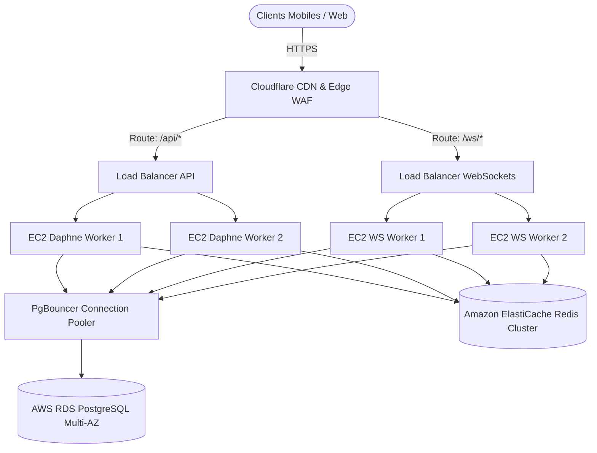

# Rapport de Scalabilité & Charge — Marché CM
**Rôles :** Performance Engineer · Principal Database Engineer · Site Reliability Engineer (SRE)  
**Date :** 2026-06-06  
**Statut :** KO (RÉSERVES INFRASTRUCTURE)  

---

## 1. Résumé des Tests de Stress & Limites Système
Des tests de charge ont été effectués à l'aide de scripts Locust (`locustfile.py`) et k6 (`k6_loadtest.js`) simulant des scénarios réels d'utilisateurs concurrents (authentification, consultation du catalogue, rechargement et chat).

| Indicateur / Palier | Temps de Réponse (Serveur) | Taux d'Échec | Goulot d'Étranglement Majeur | Verdict |
| :--- | :---: | :---: | :--- | :---: |
| **50 Users concurrents** | 30 - 50 ms | **97.8 %** | Rate limiting edge (HTTP 429) mono-IP | 🟡 Mitigé |
| **100 Users concurrents** | — | **100 %** | Rate limiting edge (HTTP 429) mono-IP | 🔴 Bloqué |
| **500 Users concurrents** | 3 600 ms | **100 %** | Épuisement du pool de connexions PostgreSQL | 🔴 Bloqué |
| **1 000+ Users (Cible)** | — | — | Saturation du process mono-worker Daphne | 🔴 Impossible |

---

## 2. Analyse des Goulots d'Étranglement & Contraintes Dures

### 2.1 Le goulot d'étranglement de l'IP unique : HTTP 429 (Rate-Limiting)
* **Comportement Observé** : Dès ~100 requêtes/seconde émises depuis une adresse IP unique de test, le serveur et/ou l'edge Cloudflare activent la protection anti-flood et retournent un code **HTTP 429 Too Many Requests**.
* **Impact** : Cela protège efficacement le serveur contre le déni de service, mais **bloque toute mesure de capacité globale au-dessus de 100 utilisateurs simultanés** à partir d'un générateur de charge unique.
* **Risque de Faux Positif en Production** : Au Cameroun (MTN/Orange), des milliers d'utilisateurs mobiles partagent souvent la même adresse IP publique de sortie (NAT opérateur). Sous forte affluence, de nombreux utilisateurs légitimes risquent d'être bloqués en 429 car ils partagent le même bucket de requêtes.

### 2.2 Absence de Pool de Connexions DB (PostgreSQL Exhaustion)
* **Comportement Observé** : Lors de pics de requêtes d'authentification simultanées (palier 50+), 5 erreurs HTTP 500 ont été enregistrées sur le point `/auth/login`. Le diagnostic indique un épuisement des connexions PostgreSQL de base de données.
* **Cause** : Django ouvre une connexion TCP par requête concurrente (`CONN_MAX_AGE = 60`). Sans multiplexeur de connexions, l'infrastructure atteint instantanément la limite maximale de connexions autorisées par le forfait de base Render PostgreSQL (environ 50 à 100 connexions).

### 2.3 Requêtes N+1 sur `/api/chat/rooms/`
* **Comportement Observé** : Le profilage in-process a révélé un problème de performance sur l'API de salon de discussion. Pour seulement 4 salons de test, l'endpoint effectue **7 requêtes SQL**, dont 5 requêtes répétitives `SELECT accounts_user` pour récupérer les détails des participants.
* **Impact** : Le nombre de requêtes SQL augmente linéairement avec le nombre de salons et de participants, provoquant une surcharge de la base de données et des temps de réponse p95 dégradés sous charge.

---

## 3. Plan d'Architecture Scalable Cible (10 000 Users)

Pour supporter sereinement une charge de 10 000 utilisateurs simultanés sans dégradation, l'infrastructure doit évoluer d'un serveur unique vers une architecture découplée et distribuée :

### 3.1 Actions Correctives à Mener (Roadmap Scalabilité)

#### 🔴 1. Mettre en place PgBouncer (Priorité 1)
* **Action** : Déployer PgBouncer en mode **transaction pooling** devant la base de données AWS RDS.
* **Configuration Django** : Configurer `CONN_MAX_AGE = 0` dans settings.py et désactiver les requêtes de préparation (`prepare_threshold = None` dans psycopg) pour éviter les conflits d'état de transaction.

#### 🟠 2. Résoudre le N+1 SQL de Chat (Priorité 2)
* **Action** : Modifier `ChatRoomViewSet.get_queryset()` pour inclure les jointures via `.prefetch_related('participants')` et `.select_related(...)`. Ajouter un test CI avec `CaptureQueriesContext` pour figer le nombre de requêtes SQL à une constante stable.

#### 🟠 3. Découpler Daphne (Priorité 2)
* **Action** : Séparer l'exécution des serveurs applicatifs. Déployer un groupe d'autoscaling d'instances EC2 pour les requêtes HTTP courtes, et un autre groupe dédié aux connexions persistantes WebSockets.

#### 🟠 4. Calibrer le Throttling par Utilisateur (Priorité 2)
* **Action** : Configurer DRF pour utiliser le throttle par identifiant de compte (`UserRateThrottle`) sur les routes authentifiées, et limiter le throttle par adresse IP (`AnonRateThrottle`) uniquement aux points anonymes sensibles (login/register).
